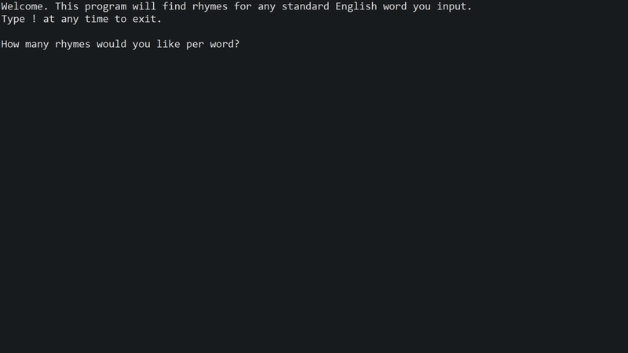

# Freestyle Rhyme Generator Project

This program is designed to function as a rhyme generator.
It was created to aid in freestyle rapping practice, so that users
could focus on perfecting their flow and sentence/context generation abilities
without having to worry about coming up with rhymes at the same time.
It can also be used by more experienced freestyle rappers to simply expand
their rhyming vocabulary and encourage use of words that they normally wouldn't use.

# Inspiration

Freestyle rapping is a hobby of mine. I freestyle with my friends all the time and I'm
the Vice President of the Freestyle Rap Club at UMD.

However, freestyling can be pretty nerve-wracking, especially for beginners.
It's scary trying to freestyle for the first time - trying to think of sentences
that rhyme with each other and make sense, all while your friends are watching you. A lot of people
never even attempt getting into the hobby because it puts them way out of their comfort zone.

I designed this program to help ease the anxiety that often comes with hopping on the mic.

# Demo

# How to Use

* This program begins by asking how many rhymes the user would like to receive
per input word. 
* Then, the user may input any standard English word and the program will return words that rhyme with it. If in the first step, the user specified that they wanted
x rhymes per input word, then x rhymes would be printed.
* The program will then prompt the user for an input word again.
* The program will keep prompting the user for input words until they input "!",
at which point the program will terminate.

Note that if the user inputs any non-standard English words, no rhymes will be generated,
and there can be no spaces in the input word. If an illegal word is entered, the program
will let you know and prompt you again.

# Built With
* [Datamuse API](https://www.datamuse.com/api/) - For rhyme generation.
* [org.json Maven Repository](https://mvnrepository.com/artifact/org.json/json) - To assist in parsing JSON data.

# Future Plans
I have a lot of ideas for this project that I am working on / would like to work on in the future.
* Create a visual interface / front end.
* Link with a random word generator to supply input words. This would allow people to push themselves
further outside their comfort zones while freestyling.
* Integrate voice recognition to determine the last word in someone's sentence and automatically produce
words that rhyme with it.
* Host program on a website or develop it into an iPhone app.
